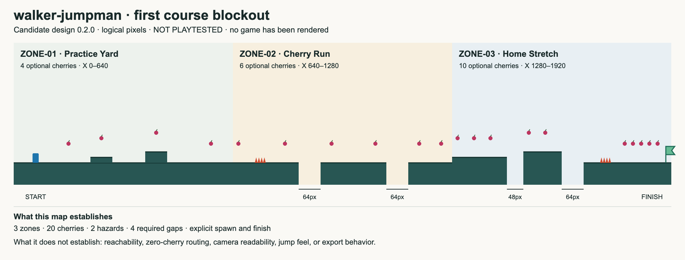

# walker-jumpman — First course blockout

Design revision: 0.2.0 · **Candidate layout; no Godot simulation or human playtest performed.**

[Editable SVG version](design/level-overview.svg)

The machine-readable coordinate authority is [level-01.json](design/level-01.json). The diagram is generated from that candidate data; this document explains the intent. The [GDD](GDD.md) remains the behavioral authority. If layout and behavior disagree, fix the layout or propose a reviewed design change—do not quietly change the jump.

## Coordinate conventions

Logical pixels, origin at top-left, positive X right and Y down. Solid rectangles use top-left plus width/height. Cherry positions are centers. Player spawn is the feet position (64,320); its proposed 18×28 collision rectangle extends upward. This distinction prevents spawning a center-based body halfway inside the floor.

The initial course spans X=0–1920, three logical viewport widths. Main floor is generally Y=320. The camera shows the playable tops, not the entire fall boundary at Y=512. No instruction in this map establishes a final rendered camera position.

## Zone intent

**Practice Yard, X=0–640:** continuous safe floor, a 16-pixel and a 32-pixel step, four overhead optional cherries. Missing an early jump lands on ground. Test that the steps can be read and approached without needing coyote timing.

**Cherry Run, X=640–1280:** one visible stationary hazard and two 64-pixel gaps. Six cherries invite extra jumps and small backtracking choices on safe ground. The direct route must be completable without touching any cherry. If a required hazard/gap jump forces incidental collection, relocate that cherry before accepting the route.

**Home Stretch, X=1280–1920:** a 48-pixel gap with a 16-pixel rise, then a 64-pixel gap to a landing 32 pixels lower; a familiar hazard before a long finishing platform. Ten cherries create a mastery pass. The finish is at the far right, not before the final collectible.

No moving-platform dependency, hidden jump ability, checkpoint, combat, or unintroduced final hazard type appears here.

## Jump constraints and initial sanity checks

| Gap | Width | Destination rise | Design interpretation |
|---|---:|---:|---|
| GAP-01 | 64 px | 0 | Same-height, well below theoretical full-speed travel |
| GAP-02 | 64 px | 0 | Repeat a known action |
| GAP-03 | 48 px | 16 px | Shorter gap compensates for raised destination |
| GAP-04 | 64 px | -32 px | Lower landing, but still verify visibility and fall control |

The GDD's continuous model estimates about 53.3 pixels of rise and 106.7 pixels of same-height travel at already attained speed. These are calculations, not route tests. Collider overlap, acceleration, step edges, takeoff position, discrete integration, and input timing still matter.

The level data contains twenty distinct cherry IDs split 4/6/10, two hazards, nine solid rectangles, and four required gaps. Those counts can be checked without Godot; reachability and fun cannot.

## Greybox acceptance

- The start is safe; no cherry, hazard, or goal overlaps the initial player body.
- Every hazard stands on a visible surface; collision is no larger than its dangerous silhouette.
- Main-route landings are visible before takeoff; first-time players do not jump at a diagram marker they cannot see in-game.
- Zero-cherry completion and all-cherry completion both work with allowed movement.
- Repeatedly missing a jump does not trap the player on an unreachable surface.
- Respawn restores all cherries, hazards, camera and input coherently.
- No collision rectangle is accepted merely because the JSON parses.

All of these gameplay checks remain unrun.

## Revision rules

Keep IDs stable when adjusting positions. Record the old/new coordinates, design reason, affected requirements, and required reruns. If deleting a cherry, replace it intentionally or revise the approved total; do not let the HUD and map silently diverge.

Move a cherry that accidentally becomes mandatory. Widen a landing or shorten a gap that fails a readable-route test. Do not raise the player's jump just to rescue one poor placement without checking every other jump.

The current map is sufficient to guide the first content pass, not permission to skip the one-room control prototype.
