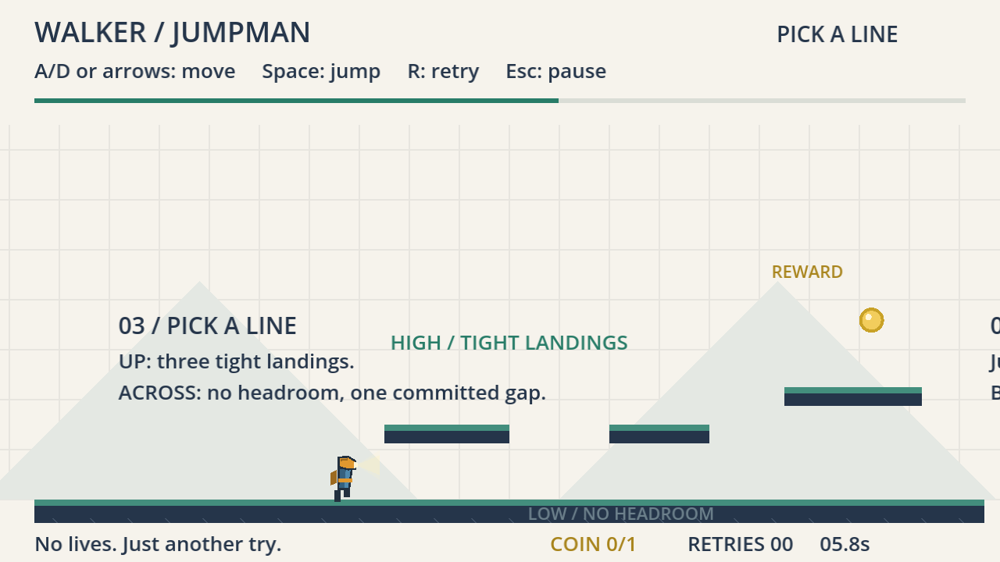
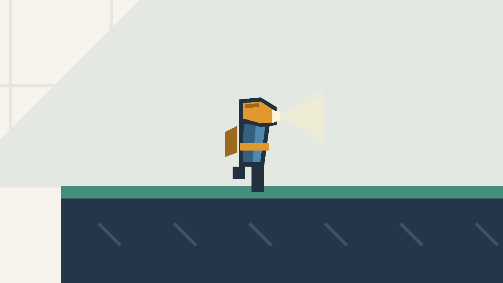
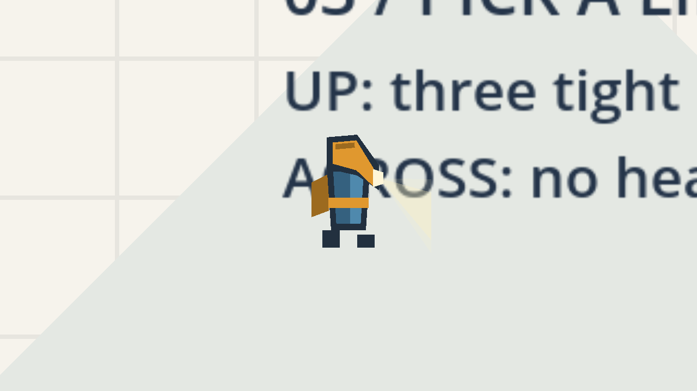

# walker-jumpman-bao-x — Pick a Line

**Bao Xing** · CSYE 7270 · Godot **4.7.2.stable.official.ed1daf0bf** · GDScript
Repository: <https://github.com/yanxlh/walker-jumpman-bao-x>

An extension of **[nikbearbrown/walker-jumpman](https://github.com/nikbearbrown/walker-jumpman)**
by Nik Bear Brown — not a new game. The starter is commit `0852e7f` in this repository,
imported with file contents byte-identical. Everything after it is mine.

My additions: a new main character (**the Lamp-Head Courier**) and a new playable
section (**Pick a Line**, a high/low fork) with the finish relocated past it.



---

## Run it

Requires Godot 4.7.2 installed at `/Applications/Godot.app`. No .NET runtime, no
external assets, no paid services.

```bash
./walker-jumpman.command
```

Or open `godot/project.godot` in the Godot editor, or:

```bash
/Applications/Godot.app/Contents/MacOS/Godot --path godot
```

## Controls

Unchanged from the starter.

| Key | Action |
|---|---|
| **A / D** or **← / →** | Move |
| **Space** | Jump (fixed height, no double jump) |
| **Enter** | Start / resume / play again |
| **R** | Retry |
| **Esc** or **P** | Pause |
| **M** | Main menu (from pause or completion) |

Retries are unlimited. There are no lives.

---

## What I changed

### The character — Lamp-Head Courier

The starter's runner is a stack of rectangles with one eye. Mine is a courier with an
oversized angular lamp housing jutting forward over a narrow torso, counterweighted by
a satchel on the trailing side, throwing a translucent light wedge in the direction of
travel. The silhouette changes from *rectangle* to *top-heavy and asymmetric*.

Four states are readable **without relying on colour**:

| | Cue |
|---|---|
| Facing | housing, satchel and beam all mirror |
| Idle | narrow beam, level legs, housing horizontal |
| Running | beam widens, torso leans into travel, legs stride |
| Airborne | housing tips nose-down, beam sweeps to the floor, legs tuck |

Only `_draw()` was rewritten. **`_physics_process`, `tuning.gd` and the 18 × 28 collider
are untouched**, and three automated checks assert that rather than claiming it.

<p align="center">


</p>

*Running and airborne. Camera zoomed 4× for these inspection frames only — the game is
never played zoomed.*

### The level — Pick a Line

A new section at **x > 960**. The original section is byte-identical, so the starter's
coyote (478,285), spike (330,310) and fall-boundary (415,432) fixtures remain valid
regression evidence.

```
                                   ($) coin 1320,206
                                    D━━━━━
                       C━━━━━                    (y=248)
          B━━━━━                                 (y=272)
 ORIGINAL ═══════════════════════════════┓ 56px ┏━━━━━━▲━━━━━⚑
  x ≤ 960     low road: roofed, no headroom      gap   trap   finish 1696
                                                       1568
```

At the end of the original floor the route forks:

- **High road** — three narrow ledges (80 / 64 / 88 px) reached by a 48 px up-jump.
  No spikes, and the last ledge drops you clear of the gap. Tight landings.
- **Low road** — keep running. The ledges overhead form a **roofed corridor you cannot
  jump in**, and it ends at a committed 56 px gap.

Both lines merge onto a final platform. Missing ledge B or C drops you onto the low
road and the run continues; missing D drops you into the gap.

Finish moved 916 → 1696. Level width 960 → 1760.

### The spring trap

The final spike is a trap, not an obstacle. It arms off plain geometry against the
player's own collider box — no trigger area, nothing drawn on the floor, no guide rail.
The arming zone sits directly above the spike and **inside the jump band only**:

- standing, you occupy y 292–320 — the zone at y 244–284 is out of reach
- airborne, you reach y 236–264 — which intersects it

So **walking never arms it and jumping beside it always does.** Jump across and the
spike launches into your own arc. The way through is to bait it from the safe side and
walk underneath, where the raised spike at y 240–256 leaves 36 px of headroom. The
measured bait window is **10 px** (x 1550–1558); at x ≥ 1560 you are already standing
in the grounded spike.

### The reward coin

One coin at (1320, 206), above ledge D — the highest surface in the game. Standing on D
your body occupies y 220–248, so it needs a jump, and because D is high-road-only **the
coin is the high road's payoff**. Low route finishes with 0, high route with 1, and both
route checks assert it.

**What the fork trades.** Precision for the coin — *not* for speed. Both branches cost
the same 671 ticks, because horizontal speed is constant and jumps do not change it.
That is the design: the high line is the reward line, and a route that buys a
collectible does not also owe you a shortcut.

### Drawing bugs fixed

The starter hard-coded coordinates that silently break when level data moves:

- spikes drawn at literal `y = 320 / 304`, ignoring the hazard rect
- finish pole drawn between literal `y = 320` and `250`
- grid looped to literal `961`; background `Rect2(-400,-200,1800,900)`; parallax at `x = [100,470,770]`
- HUD progress divided by the literal `852` (old finish − spawn)

All now derive from level data. Verified with a deliberately wrong fixture, because
the relocated finish kept the original y-range and would otherwise have rendered
correctly *by accident* — `evidence/screens/13-p5-datadriven-fixture.png`.

---

## Verification

**49 automated checks, 0 failures** — 25 starter checks still passing with their
assertions unmodified, plus 15 new, plus 9 keyboard checks.

```bash
/Applications/Godot.app/Contents/MacOS/Godot --headless --path godot --script res://tests/test_game.gd
/Applications/Godot.app/Contents/MacOS/Godot --headless --path godot --script res://tests/test_keyboard.gd
/Applications/Godot.app/Contents/MacOS/Godot --headless --path godot --script res://tests/probe_reach.gd
node scripts/record-build.cjs
```

Both branches complete with zero deaths in **671 ticks**, under the starter's original
900-tick ceiling, which was deliberately left unchanged.

Geometry was chosen by measurement. `tests/probe_reach.gd` sweeps real takeoff
positions through real physics; it **rejected my first layout**, proving that a jumping
player's head reaches y ≈ 236 while the ledges sat at y = 272–284, so parallel roads
that both require jumping are unbuildable at this tuning. I revised the geometry rather
than the jump.

Full detail: **[TEST-REPORT.md](TEST-REPORT.md)** · predictions frozen before building:
**[CHANGE-BRIEF.md](CHANGE-BRIEF.md)** · honest log: **[FRICTIONAL.md](FRICTIONAL.md)** ·
credits: **[SOURCES.md](SOURCES.md)**

---

## Known limitations

1. **One playtester, and he designed the level.** Both branches, the failure/retry loop
   and replay were played by hand (`TEST-REPORT.md` §7), but by the person who built it.
   Discoverability for someone who has never seen it is untested. Pause, resume and
   manual R are machine-checked only.
2. **The outro card is silent.** The stock jingle asset is missing from the toolkit
   checkout; reported as an asset blocker rather than substituted. Everything else on
   that card conforms to the outro lock.
4. **The 10 px bait window has not been tried by a human.** It is geometry-bounded and
   reproducible in the probe, but 10 px is 0.06 s of walking at full speed, and whether
   a person can find it without frustration is exactly what is untested.
5. **The trap's timing constants are untested against human reaction.** `rise 0.18 s`,
   `hold 2.6 s`, `fall 0.45 s` were chosen so the scripted route clears comfortably.
6. **The high road is entry-committed.** Once on the low road the window back up onto
   ledge B is 4 px. Kept deliberately, but it was a consequence discovered by
   measurement, not an original intention.
7. **Missing ledge D kills you**, unlike B and C. Recorded in the change brief before
   implementation.
8. **Extension coverage is route-based.** One fixed input line per branch. Off-route
   behaviour in the new section is unverified.
9. **Source only.** No Web export, no standalone application.

## Film

Rendered with the course Brutalist `godot-waikthrough` skill in **walker** mode.

| | |
|---|---|
| Filename | `claude-liam-walker-jumpman-bao-x-walkthrough.mp4` |
| SHA-256 | `9d82df50cf6d012e5f5138689dcf3dd7dc279dccb5c3b24117ec64e14fb94ec9` |
| Spec | 3840 × 2160, 30 fps, h264 / AAC, **3:22** (202.0 s) |
| Link | *upload to course media storage pending* |

Gameplay is **real engine capture at native 4K**, driven by real key events, labeled
`SCRIPTED INPUT` on screen; frozen tails are labeled `HELD FRAME`. Narration is AI
(Liam / Kokoro `am_onyx`), stated in the outro.

Reel: [`youtube/claude-liam-walker-jumpman-bao-x-walkthrough/`](youtube/claude-liam-walker-jumpman-bao-x-walkthrough/)

| Document | What it holds |
|---|---|
| `beat_sheet.json` | 13 beats, measured durations |
| `coverage.json` | 19 implemented features with evidence, 5 named as not built |
| `CAPTURE.md` | how the capture was driven, and the one disclosed deviation |
| `FACTCHECK.md` | every numeric claim traced to source |
| `SHOTLIST.md` / `RIFF.md` / `PROMPTS.md` / `BUILD-PROMPT.md` | shot list, commentary, provenance, reproduction |
| `_qc/REPORT.md` / `_qc/HUMAN-REVIEW.md` | gate output, and what I checked by eye |

**Known asset blocker:** the stock outro jingle (`svg/claude/mp3/`) is absent from this
checkout of brutalist.art, so the final card is silent rather than silent-under-jingle.
Reported rather than substituted, per the skill.

Media (`*.mp4`, `*.avi`, `*.mp3`) is gitignored per the assignment; `BUILD-PROMPT.md`
reproduces it.

## Repository layout

```
godot/                  the playable Godot project
  features/player/      player.gd (courier), tuning.gd (untouched)
  game/session.gd       state machine + data-driven drawing
  levels/               first_steps.json — original + extension geometry
  ui/hud.gd
  tests/                test_game.gd, test_keyboard.gd, probe_reach.gd, capture_game.gd, route_driver.gd
evidence/               test receipts, baseline/, screens/, build-manifest.json
film/                   beat sheet, script, narration prompts
scripts/record-build.cjs
CHANGE-BRIEF.md  TEST-REPORT.md  FRICTIONAL.md  SOURCES.md
STARTER-README.md + GDD.md, GAME-BRIEF.md, ...   the starter's own documents, unedited
```

The starter's design documents describe the **starter's** state and proposed course.
They are retained as received and do not describe this extension.
